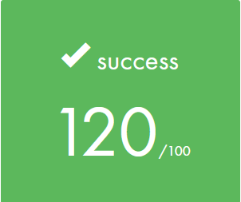

<h1 align="center">cub3D - Our First RayCaster with miniLibX </h1>

  

## Overview
cub3D is a graphics programming project inspired by the iconic Wolfenstein 3D game. The goal is to create a realistic 3D graphical representation of a maze from a first-person perspective using Ray-Casting principles. The project explores the practical applications of mathematics and graphic design, enhancing skills in areas like windows, colors, events, and algorithm development.

## Features

- **Ray-Casting:** Implements a dynamic view inside a maze using Ray-Casting principles.
- **Graphics:** Uses the miniLibX library to create a smooth window management system.
- **Textures:** Displays different wall textures based on the wall's facing direction (North, South, East, West).
- **Colors:** Allows customization of floor and ceiling colors.
- **Controls:** Supports keyboard controls for navigation (W, A, S, D) and view rotation (arrow keys).
- **Scene Description:** Parses a scene description file with specific elements, including textures, colors, and map layout.
- **Wall Collisions:** Enhanced with the ability to detect and handle collisions with walls.
- **Minimap System:** Includes a minimap for better spatial awareness.
- **Doors Functionality:** Supports doors that can be opened and closed.
- **Mouse-Based POV Rotation:** Enables rotation of the point of view using the mouse.

## Grade

  

